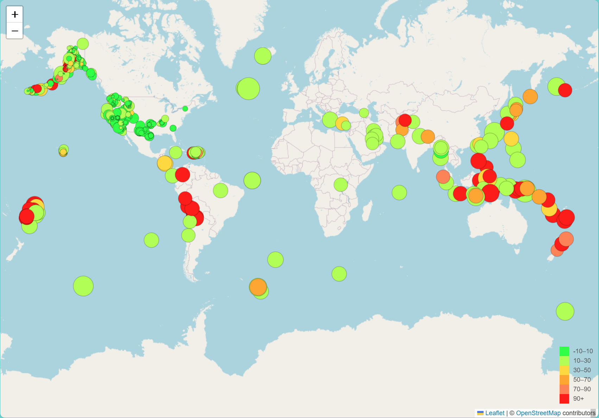

# Module 15: leaflet-challenge

### Overview

This assignment utilizes data collected by the United States Geological Survey ("USGS"), and generates a world map indicating location, magnitude and depth of earthquakes. I chose the dataset containing all earthquakes in the past 7 days (updated every 30 minutes): https://earthquake.usgs.gov/earthquakes/feed/v1.0/summary/all_week.geojson.

### Repo Contents

1. Images folder - contains a sample image of the map
2. Leaflet-Part-1 - folder containing all of the javascript and html files to generate the map:
    a. static folder - contains two subfolders:
        i. css - contains the style.css file
        ii. js - contains the logic.js file which reads in the JSON file and generates the map
    b. index.html - html file to run the javascript file and generates the map
3. README.md

### Part 1: Earthquake Visualization

This code imports and visualizes the earthquake data using Leaflet, creating a map that plots all the earthquakes from the dataset based on their longitude and latitude.

* Data marker size reflects the magnitude of the earthquake - the larger the marker, the greater the magnitude. 
       
* Data marker color reflects the depth of the earthquake in kilometers.
       
* Popups provide additional information (location, magnitude and depth) about the earthquake when its associated marker is clicked.
       
* A legend provides context for the marker colors.

Below is a sample map:

